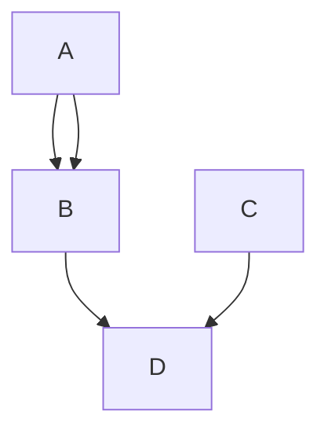

# Пример работы с Dendron

## Пример работы с картинкой

Здесь у нас про 1С [^1]


> We're living the future so
> the present is our past.

---

```ruby
Сообщить("Привет, мир!");
```

- [x] list syntax required (any unordered or ordered list supported)
- [x] this is a complete item
- [ ] this is an incomplete item

### Таблицы

Колонка 1 | Колонка 2 | Колонка 3 | Колонка 4 | Колонка 5 | Колонка 6 | Колонка 7 | Колонка 8 | Колонка 9 | Колонка 10 | Колонка 11 | Колонка 12
----------|-----------|-----------|-----------|-----------|-----------|-----------|-----------|-----------|------------|------------|-----------
1 | 2 | 3 | 4 | 5 | 6 | 7 | 8 | 9 | 10 | 11 | 12
3 | 4 | 5 | 6 | 7 | 8 | 9 | 10 | 11 | 12 | 13 | 14
5 | 6 | 7 | 8 | 9 | 10 | 11 | 12 | 13 | 14 | 15 | 16
7 | 8 | 9 | 10 | 11 | 12 | 13 | 14 | 15 | 16 | 17 | 18
9 | 10 | 11 | 12 | 13 | 14 | 15 | 16 | 17 | 18 | 19 | 20
11 | 12 | 13 | 14 | 15 | 16 | 17 | 18 | 19 | 20 | 21 | 22
13 | 14 | 15 | 16 | 17 | 18 | 19 | 20 | 21 | 22 | 23 | 24
15 | 16 | 17 | 18 | 19 | 20 | 21 | 22 | 23 | 24 | 25 | 26
17 | 18 | 19 | 20 | 21 | 22 | 23 | 24 | 25 | 26 | 27 | 28
19 | 20 | 21 | 22 | 23 | 24 | 25 | 26 | 27 | 28 | 29 | 30
21 | 22 | 23 | 24 | 25 | 26 | 27 | 28 | 29 | 30 | 31 | 32
23 | 24 | 25 | 26 | 27 | 28 | 29 | 30 | 31 | 32 | 33 | 34

### Из интересного для Dendron

*[1C]: Самая лучшая платформа на планете

[^1]: 1С -Самая лучшая платформа на планете

{{ fm.myfield }}


<details>
  <summary>Тут спойлер</summary>
  
   ## Heading
  1. A numbered
  2. list
     * With some
     * Sub bullets
</details>